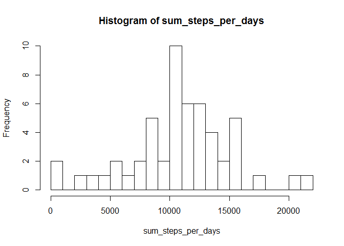
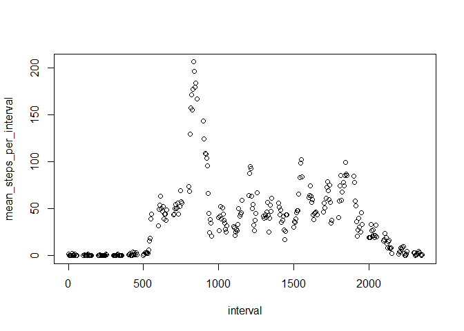
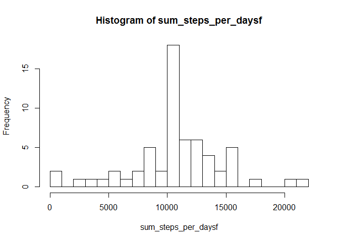

## Loading and preprocessing the data


This is an R Markdown document. here is the code for reading the activity data:


```r
DT <- read.table("activity.csv",sep=',',header=T)
DT$date <- as.Date(DT$date)
head(DT)
```

```
##   steps       date interval
## 1    NA 2012-10-01        0
## 2    NA 2012-10-01        5
## 3    NA 2012-10-01       10
## 4    NA 2012-10-01       15
## 5    NA 2012-10-01       20
## 6    NA 2012-10-01       25
```

```r
summary(DT)
```

```
##      steps             date               interval     
##  Min.   :  0.00   Min.   :2012-10-01   Min.   :   0.0  
##  1st Qu.:  0.00   1st Qu.:2012-10-16   1st Qu.: 588.8  
##  Median :  0.00   Median :2012-10-31   Median :1177.5  
##  Mean   : 37.38   Mean   :2012-10-31   Mean   :1177.5  
##  3rd Qu.: 12.00   3rd Qu.:2012-11-15   3rd Qu.:1766.2  
##  Max.   :806.00   Max.   :2012-11-30   Max.   :2355.0  
##  NA's   :2304
```


## What is mean total number of steps taken per day?

Here is code for calculating sum of steps per day:


```r
sum_steps_per_days <- with(DT[complete.cases(DT),],tapply(steps,date,sum))
hist(sum_steps_per_days,n=30)
```

<!-- -->

```r
mean_s <- round(mean(sum_steps_per_days),1)
median_s <- median(sum_steps_per_days)

summary(sum_steps_per_days)
```

```
##    Min. 1st Qu.  Median    Mean 3rd Qu.    Max. 
##      41    8841   10765   10766   13294   21194
```

the histogram of number of steps taken each day is plotted above. the mean and median of total number of steps taken per day is 1.07662\times 10^{4} and 10765, respectively.

## What is the average daily activity pattern?

Here is code for calculating mean number of steps per interval:


```r
mean_steps_per_interval <- with(DT[complete.cases(DT),],tapply(steps,interval,mean))
int <- names(mean_steps_per_interval)
plot(int,mean_steps_per_interval,xlab="interval")
```

<!-- -->

```r
max_int <- int[which.max(mean_steps_per_interval)]
```

the time series of average number of steps taken in each interval is plotted above. 5-minute interval of 835, on average across all the days in the dataset, contains the maximum number of steps.


## Imputing missing values

Here is code for dealing with missing values:


```r
num_of_missing <- sum(!complete.cases(DT))

DT_full <- DT
 
for (i in 1:length(DT$date)) {
 if (is.na(DT$steps[i])) {
DT_full$steps[i] <- mean_steps_per_interval[as.numeric(int)==DT$interval[i]]
}
}
  
summary(DT_full)
```

```
##      steps             date               interval     
##  Min.   :  0.00   Min.   :2012-10-01   Min.   :   0.0  
##  1st Qu.:  0.00   1st Qu.:2012-10-16   1st Qu.: 588.8  
##  Median :  0.00   Median :2012-10-31   Median :1177.5  
##  Mean   : 37.38   Mean   :2012-10-31   Mean   :1177.5  
##  3rd Qu.: 27.00   3rd Qu.:2012-11-15   3rd Qu.:1766.2  
##  Max.   :806.00   Max.   :2012-11-30   Max.   :2355.0
```

```r
sum_steps_per_daysf <- with(DT_full,tapply(steps,date,sum))
hist(sum_steps_per_daysf,n=30)
```

<!-- -->

```r
mean_sf <- mean(sum_steps_per_daysf)
median_sf <- median(sum_steps_per_daysf)

summary(sum_steps_per_daysf)
```

```
##    Min. 1st Qu.  Median    Mean 3rd Qu.    Max. 
##      41    9819   10766   10766   12811   21194
```

there are 2304number of rows with NA in the date set. The missing values are replaced with mean for that 5-minute interval.

the histogram of number of steps taken each day for the data with replaced missing vales is plotted above. the mean and median of total number of steps taken per day is 1.0766189\times 10^{4} and 1.0766189\times 10^{4}, respectively. As it is clear, the numbers are slightly diffrent from the dataset without replaced missing values.

## Are there differences in activity patterns between weekdays and weekends?

Here is code for comparing weeknd data with weekday data:


```r
DT_full$weekdays <- weekdays(DT_full$date)

DT_full$wkvswnd[(DT_full$weekdays == "Saturday" | DT_full$weekdays == "Sunday")] <- "weekend"
DT_full$wkvswnd[!(DT_full$weekdays == "Saturday" | DT_full$weekdays == "Sunday")] <- "weekday"

DTWeekend <- subset(DT_full, wkvswnd == "weekend")
DTWeekday <- subset(DT_full, wkvswnd == "weekday")
        
mean_steps_per_interval_weekend <- with(DTWeekend,aggregate(steps,by=list(interval),mean))

colnames(mean_steps_per_interval_weekend) <- c("interval", "mean_steps")

mean_steps_per_interval_weekend$wkvswnd <- "weekend"

mean_steps_per_interval_weekday <- with(DTWeekday,aggregate(steps,by=list(interval),mean))

colnames(mean_steps_per_interval_weekday) <- c("interval", "mean_steps")

mean_steps_per_interval_weekday$wkvswnd <- "weekday"

mean_steps_per_interval_all <- rbind(mean_steps_per_interval_weekend, mean_steps_per_interval_weekday)
```


<!-- -->


Note that the `echo = FALSE` parameter was added to the code chunk to prevent printing of the R code that generated the plot.
